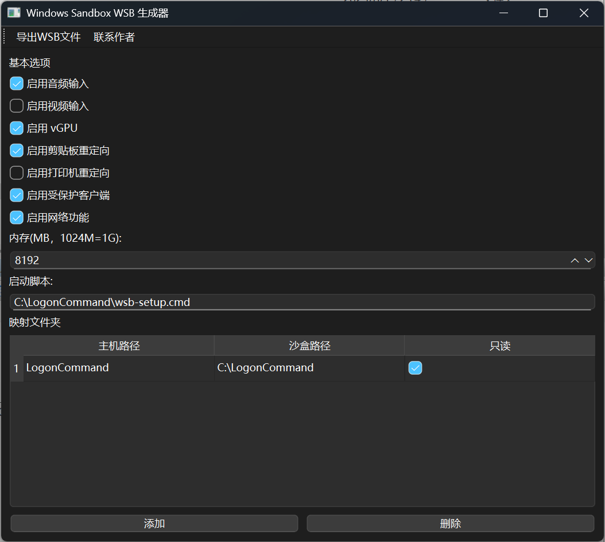

# Windows Sandbox WSB 文件生成工具

这是一个用于生成 Windows Sandbox WSB 文件的脚本工具。



## 编译启动器（可选）

### 编译

在 Windows 下安装 [MSYS2](https://www.msys2.org/)，使用 `MSYS2 UCRT64` 终端。

```bash
$ make
```

使用方法：
- `make all` - 构建目标可执行文件。
- `make clean` - 清理生成的文件。
- `make help` - 显示此帮助菜单。

## 运行

### 环境依赖

```cmd
git clone https://github.com/luxiaoyou/WSBGen.git
cd WSBGen\build
python -m venv env
env\Scripts\activate.bat
pip install -r requirements.txt
```

### 运行方式

#### 方式一

如果您的 Python 环境或者虚拟环境已经安装了 `python3` + `PySide6`，不需要启动器，可以直接运行：

```cmd
mkdir WSBGen
cd WSBGen
wget -L https://raw.githubusercontent.com/luxiaoyou/WSBGen/main/WSBGen.py -O WSBGen.py
pythonw WSBGen.py
```

#### 方式二

编译启动器：

```bash
make all
```

然后双击编译出来的程序 `WSBGen.exe`。启动器会优先调用当前目录下的 `env` 虚拟环境，如果不存在此虚拟环境，则直接使用系统默认的 Python 环境。

### 导出 WSB 文件

运行`WSBGen.exe`程序后，直接点击按钮 `导出 WSB 文件`。默认生成的 WSB 文件可以直接使用，同时会生成相应的文件和目录结构如下：

```bash
$ tree
.
├── FileName.wsb      # 沙盒启动文件，详细请查看文件
├── LogonCommand
│   ├── ipconfig.reg  # 桌面右键添加：获取沙盒环境 IPv4 地址，详细请查看文件
│   ├── wsb-setup.cmd # 沙盒环境启动时运行的 DOS 命令，详细请查看文件
│   └── wsb-setup.ps1 # 沙盒环境启动时运行的 PowerShell 命令，详细请查看文件
├── WSBGen.exe        # 启动器，用于启动 main.py，详细请查看文件
├── config.db         # 程序配置数据存储在 SQLite 数据库中，默认文件，详细请查看文件，推荐使用 DB Browser for SQLite
└── main.py           # 主程序，可以单独作为 Python 脚本运行，也可以用 WSBGen.exe 启动，详细请查看文件

2 directories, 7 files
```

## 获取沙盒 IP

按下 `Win` + `R`，运行 `powershell`，然后执行以下命令：

```powershell
wsb ip --id (wsb list)
```